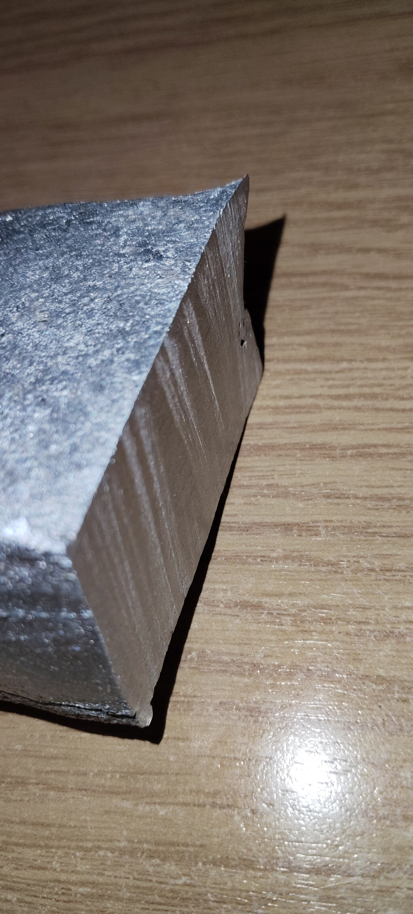
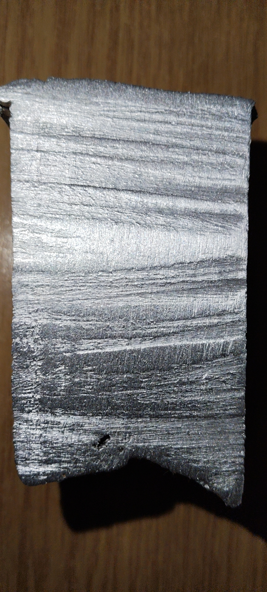
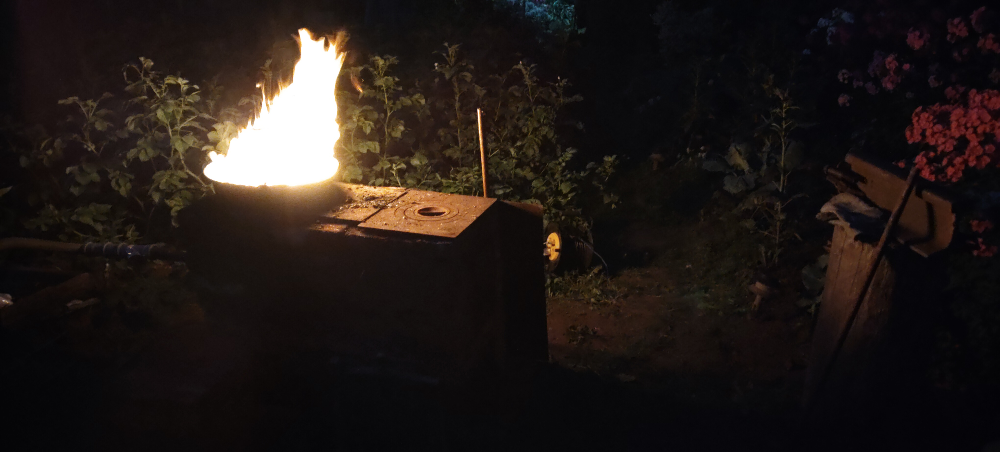
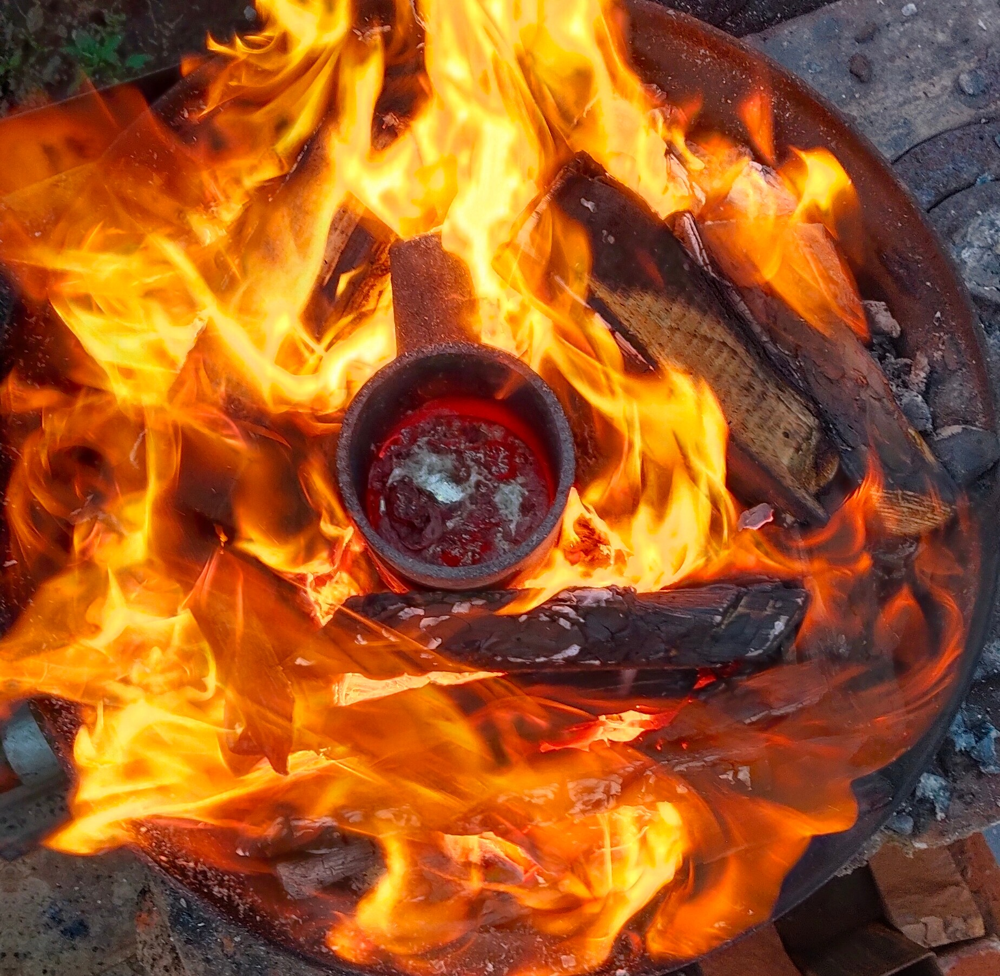
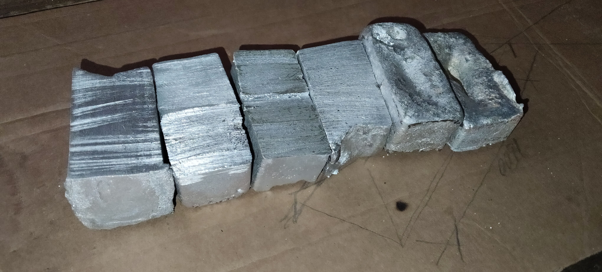
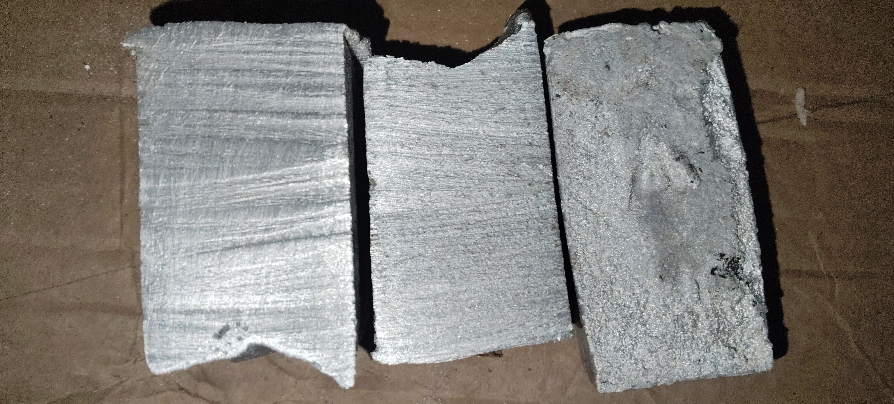

# Open-Humanoid-180

[Project Roadmap](https://github.com/ProMineGG/Open-Humanoid-180/issues/1)
[Contributing](CONTRIBUTING.en.md)

*Read this in other languages: [Русский](README.md)*

**An open‑source 180 cm bipedal humanoid robot – built with off‑the‑shelf components, DIY harmonic drives, and a distributed computing architecture.**

---

## Overview

The goal is to build a full‑size (180 cm, ~55 kg) walking robot with onboard AI (vision + language models) for a budget of around **275,000 RUB**. Instead of expensive industrial actuators, we use:

- **DIY two‑stage strain‑wave (harmonic) reducers with intermediate rolling elements** – standard bearing rollers as the rolling elements.
- **BLDC motors** of four types (6384, 5065, 5010, 3205) – 36 degrees of freedom in total.
- A **laptop with an RTX 3080** (without its case) as the main brain – an affordable alternative to specialised high‑cost modules, offering both performance and accessibility.
- **Distributed control network:** ESP32‑S3 as a CAN gateway, AT32F403ACGU7 (compatible with GD32F303) for low‑level FOC, and repurposed hoverboard mainboards for medium and basic motors.

All mechanical parts are designed for **home‑cast aluminium** (using a charcoal furnace) or **3D printing** (PETG / PA12‑CF) on an Ender 3 V3 Plus.

---

## Key Specifications

| Parameter                | Value                                                                        |
| :----------------------- | :--------------------------------------------------------------------------- |
| Height / Weight          | 180 cm / ~55 kg (target)                                                     |
| Degrees of Freedom       | 36 (6 high‑power + 7 medium + 10 basic + 13 low‑power)                       |
| Battery                  | 7S Li‑NMC (SK 3.7V 80.5Ah) + JK Smart BMS (200A)                             |
| Main power bus           | 25.9–29.4 V (nominal 25.9 V, max 29.4 V)                                    |
| Secondary voltages       | 19.5 V (laptop), 5 V (logic + display), 6 V / 12 V (reserve)                 |
| Compute                  | Laptop Lenovo L7 / R9 / RTX 3080 / 32GB / 1TB (Ubuntu 22.04 + RT‑Preempt)    |
| Real‑time node           | ESP32‑S3 (CAN gateway, IMU acquisition, I/O expansion)                       |
| Motor controllers        | ODrive3.6 (×3), Hoverboard mainboards (×9), SimpleFOCMini (×13)              |
| Communication            | CAN (TJA1042T) + SPI (encoders) + UART (bridge to ESC)                       |
| Sensors                  | 11× BMI160+QMC5883L, 10× FSR402, 4× XNQJALYCY 100 kg load cells              |
| Budget (August 2026)     | ~274,706 RUB (full breakdown in [BOM.en.md](./docs/BOM.en.md))               |
| License                  | **GNU GPLv3** (code, CAD, schematics)                                        |

---

## Actuator Layout and Reducers

The mechanics follow a modular design. Motor distribution across joints:

- **Legs (8 actuators):**  
  – **6× 6384 120KV** (reduction 1:100) – 2 per hip (flexion/abduction) + 1 per knee.  
  – **2× 5010 360KV** (reduction 1:65) – hip rotation (one per leg).

- **Torso and neck (4 actuators):**  
  – **1× 5065 140KV** (1:65) – torso tilt (waist).  
  – **3× 3205 110KV** (1:40) – neck (2 tilts + 1 pan).

- **Arms (24 actuators):**  
  – **4× 5065 140KV** (1:65) – shoulders (2 per arm: elevation and abduction).  
  – **2× 5010 360KV** (1:40) – shoulders (rotation, 1 per arm).  
  – **2× 5065 140KV** (1:65) – elbows (flexion, 1 per arm).  
  – **2× 5010 360KV** (1:40) – elbows (forearm rotation, 1 per arm).  
  – **4× 5010 360KV** (1:40) – wrists (2 per arm: flexion/abduction, actuators placed in the forearm with Bowden cables).  
  – **10× 3205 110KV** (1:40) – fingers (5 per arm, flexion).

**Totals:**  
- 6384 – 6 pcs  
- 5065 – 7 pcs (4 shoulders + 2 elbows + 1 waist)  
- 5010 – 10 pcs (2 hips + 2 shoulder rotations + 2 elbow rotations + 4 wrists)  
- 3205 – 13 pcs (3 neck + 10 fingers)

**Reducers:**  
DIY **strain‑wave gears with rolling elements (ПТК)**.  
- Two‑stage design; overall reduction ratios:  
  - 1:100 – for high‑power (6384)  
  - 1:65 – for medium (5065) and basic (5010) in hip joints  
  - 1:40 – for low‑power (3205) and basic (5010) in shoulders, elbows and wrists  
- Rolling elements are standard bearing rollers (cheap and wear‑resistant).  
- Housings are cast in aluminium or printed in PA12‑CF.

### Reducer Manufacturing Process (DIY Casting)

For the reducers, aluminium scrap is remelted into purified ingots in a home‑built furnace.

<table align="center" border="0" cellpadding="5" cellspacing="0">
  <tr>
    <td valign="top">
      <table border="0" cellpadding="5" cellspacing="0">
        <tr><td></td></tr>
        <tr><td></td></tr>
      </table>
    </td>
    <td valign="top">
      <table border="0" cellpadding="5" cellspacing="0">
        <tr><td></td></tr>
        <tr><td></td></tr>
        <tr><td></td></tr>
        <tr><td></td></tr>
      </table>
    </td>
  </tr>
</table>

---

## Power Distribution and Protection

- **Battery:** 7S Li‑NMC (SK 3.7V 80.5Ah, pouch cells) – high energy density at moderate weight.  
- **BMS:** JK‑B2A8S20P (200A continuous, 7S support) with Bluetooth monitoring.  
- **Main protection:** 200A DC circuit breaker on the positive line.  
- **Fuse block:** ATO hub with 10 slots – 40A for arms/torso, 25A for the laptop and 5V converters, 10A for the head.  
- **Individual fuses:** 3 single holders with 80A fuses – one per ODrive3.6 (fed directly from the distribution blocks, not via the hub).  
- **Distribution blocks:** two 250A (12‑terminal) blocks – positive and negative buses.  
- **Bus capacitors:** 2× 4700 µF / 50V – dampen regenerative spikes.  
- **Local filtering:** 0.1 µF ceramic capacitors on every SPI/I2C line and driver board to suppress PWM noise.  
- **Wiring:** signal lines use shielded MKESh cable, shields grounded at a single point (the negative distribution block) to avoid ground loops.

All DC‑DC converters (1500W, 600W, 300W) are **oversized** and operate **without active cooling** – no additional fans, except for a 140‑mm blower for the laptop.

---

## Compute and Communication Architecture

### Layers

1. **High level (laptop)**  
   Ubuntu 22.04 with RT‑Preempt kernel. Runs ROS2, YOLO, and VLM models (Qwen 3.5 9B / RT‑2X). Receives sensor data from the ESP32 and sends target motion commands.

2. **Middle level (ESP32‑S3)**  
   Polls 11× BMI160+QMC5883L (via SPI), 4× HX711 ADCs, and an array of FSR402 (through a CD74HC4067 multiplexer). Fuses IMU data for orientation estimation and forwards it to the laptop. Also serves as the **CAN gateway** for all motor controllers.

3. **Low level (joint controllers)**  
   – **ODrive3.6** (×3) – drive 6 high‑power motors (6384) via CAN.  
   – **Hoverboard mainboards** (×9) – each drives 2 motors (5065 or 5010). Total 18 channels, 17 actually used (7 medium + 10 basic). These boards have **UART only**, so we use **AT32F403ACGU7** as UART‑to‑CAN bridges: one MCU polls 2–3 hoverboard boards and relays data to the ESP32 over CAN.  
   – **SimpleFOCMini** (×13) – drive 13 low‑power motors (3205) directly with AT32F403ACGU7 (also reading SPI encoders).  
   – **Encoders:** 36× MT6826S – 14‑bit absolute, SPI interface.

### Sensor Network

- **IMU nodes:** 11× BMI160 (accelerometer+gyroscope) with soldered‑on QMC5883L (magnetometer) – connected to the ESP32 via SPI (I2C is used only locally between BMI and QMC on the same module).  
- **Tactile:** 10× FSR402 on fingers → analog multiplexer CD74HC4067 → ESP32 ADC.  
- **Foot force:** 4× XNQJALYCY 100 kg load cells (2 per foot) → HX711 → ESP32.

---

## Project Status (August 2026)

- [x] Full component selection and cost estimation (see `/docs/BOM.en.md`).  
- [x] Preliminary power distribution and wiring scheme.  
- [x] Aluminium casting test – successful (melting scrap in a charcoal furnace with salt/soda flux).  
- [ ] 3D printer (Ender 3 V3 Plus) and materials are on hand.  
- [ ] CAD models of all reducers – in progress.  
- [ ] First prototype joint – active CAD development, tolerance analysis, and sourcing of budget suppliers; procurement will start after CAD completion.  
- [ ] Firmware for ESP32 and AT32F403ACGU7 – will be published after debugging.  
- [ ] URDF model for Gazebo.

---

## Repository Structure

* [`BOM.en.md`](./docs/BOM.en.md) – Full Bill of Materials with prices, quantities, and links to Ozon / AliExpress / Avito.  
* [`power_schematic.en.md`](./docs/power_schematic.en.md) – Power schematic, fuse distribution (200A breaker, ATO hub, separate 80A for ODrive), WAGO terminal wiring.  
* [`weight_budget.en.md`](./docs/weight_budget.en.md) – Mass breakdown, centre‑of‑mass estimation, material choices (aluminium / PETG / PA12‑CF).  
* [`kinematics.en.md`](./docs/kinematics.en.md) – Kinematic layout (joint axes distribution, motor types).  

* [`in progress/motor_selection.en.md`](./docs/in%20progress/motor_selection.en.md) – Actuator calculations: KV selection, joint torques, reduction ratio justification *(in progress)*.  
* [`in progress/reducer_design.en.md`](./docs/in%20progress/reducer_design.en.md) – Engineering details of the two‑stage strain‑wave reducer with rolling elements *(in progress)*.  
* [`in progress/casting_aluminium.en.md`](./docs/in%20progress/casting_aluminium.en.md) – Step‑by‑step guide to home aluminium casting *(in progress)*.  
* [`in progress/assembly_guide.en.md`](./docs/in%20progress/assembly_guide.en.md) – Assembly sequence, cable routing, shielding practices *(in progress)*.  
* [`in progress/alternative_parts.en.md`](./docs/in%20progress/alternative_parts.en.md) – Budget alternatives and ESC modification notes *(in progress)*.  

* [`hardware/STL/`](./hardware/STL/) – 3D‑printable models (PETG – housings, PA12‑CF – reducer cages, TPU – feet soles).  
* [`hardware/CAD/`](./hardware/CAD/) – CAD source files (FreeCAD / STEP) – under development.  
* [`software/esp32_firmware/`](./software/esp32_firmware/) – ESP32‑S3 firmware: IMU polling (SPI), CAN gateway, UART‑to‑CAN bridge logic.  
* [`software/at32_firmware/`](./software/at32_firmware/) – AT32F403ACGU7 firmware: SimpleFOCMini driver, MT6826S encoder reading (SPI), UART communication with ESC.  
* [`simulation/urdf/`](./simulation/urdf/) – URDF/XACRO model for Gazebo / Isaac Sim (to be added).

---

## Contributing and License

We invite co‑authors with experience in:

- **ROS2 control** and **URDF/XACRO modelling**.  
- **Low‑level FOC tuning** (especially current limits for low‑inductance motors).  
- **Simulation** (Gazebo / Isaac Sim) for gait development.  
- **Mechanical CAD** (FreeCAD, Fusion 360) – help needed to turn sketches into finished models.

Detailed contribution guidelines can be found in [CONTRIBUTING.md](CONTRIBUTING.md).

Open Issues and Pull Requests are welcome. A Telegram channel for discussions will be created soon.

**License:** All code, CAD, and schematics are released under **GNU GPLv3** – commercial use is allowed only if the derived work remains fully open.

---

*Built with standard tools, litres of technical coffee, and a stubborn refusal to buy expensive proprietary parts.*